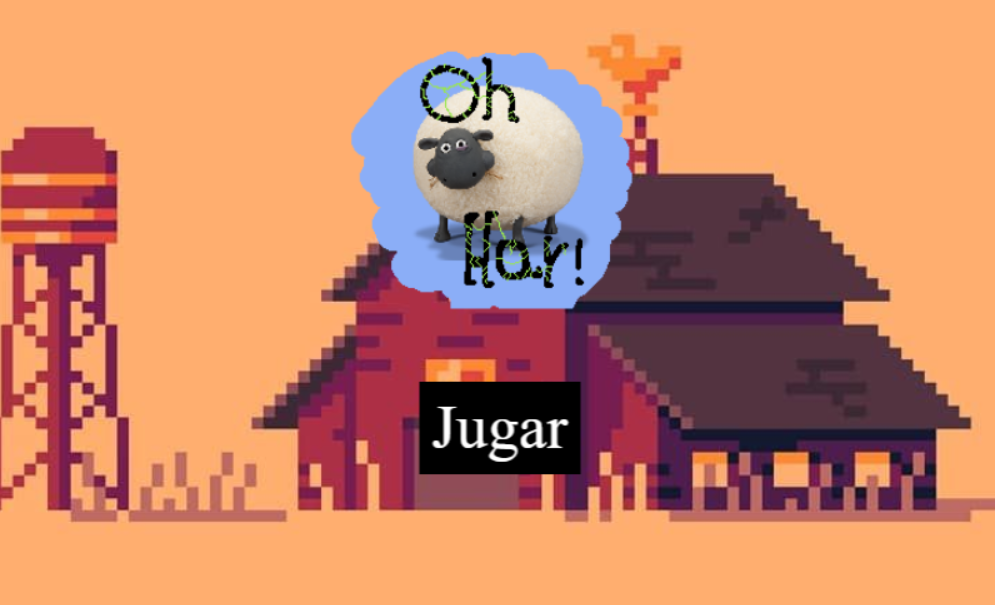
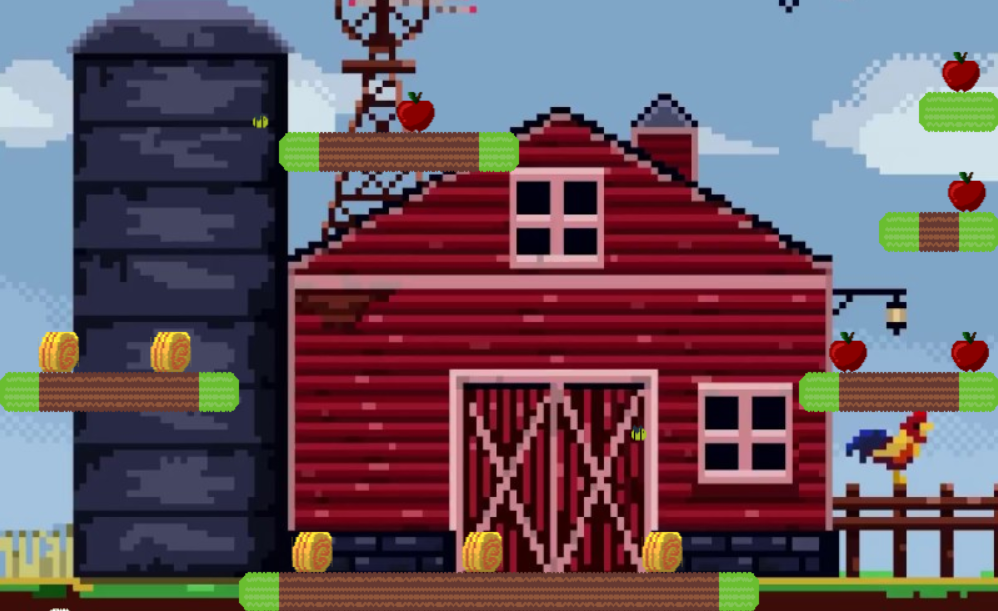

# CORRIDA DAS MACAS
👨‍🏫O JOGADOR CONTROLA UM PERSONAGEM QUE PRECISA COLETAR ITENS (PAJAS E MAÇÃS) ENQUANTO DESVIA DE INIMIGOS (ABELHAS).

 <br> 
 <br>

## DESCRIÇÃO:
O jogo é um plataforma 2D desenvolvido com Phaser 3. O jogador controla um personagem que precisa coletar itens (pajas e maçãs) enquanto desvia de inimigos (abelhas). O jogo possui três níveis, cada um com desafios e objetivos específicos. O objetivo principal é coletar todos os itens e evitar as abelhas para avançar para o próximo nível ou ganhar o jogo.

## ESTRUTURA DO JOGO:
1. **Menu Principal**:
   - Tela inicial com um botão "Jogar" que inicia o jogo no primeiro nível.

2. **Níveis**:
   - **Nível 1**: O jogador coleta pajas e maçãs e deve evitar abelhas.
   - **Nível 2**: Desafios semelhantes ao Nível 1, mas com diferente disposição dos objetos.
   - **Nível 3**: Último nível onde, após coletar todos os itens, o jogador vence o jogo.

3. **Cenas Auxiliares**:
   - **retry**: Tela exibida quando o jogador perde, com a opção de tentar novamente.
   - **victory**: Tela exibida quando o jogador vence o jogo.

## EXECUTANDO O PROJETO:
1. **Instalando as Depêndencias:**
   - Para instalar as dependências listadas no arquivo "package.json", você pode usar o comando `npm install` no terminal. Certifique-se de estar no diretório do seu projeto onde o arquivo "package.json" está localizado. O npm irá ler o arquivo "package.json" e instalar todas as dependências listadas nele:

   ```bash
   npm install
   ```

2. **Subindo o Servidor:**
   - Para subir o servidor, no diretório do seu [projeto](./CODIGO/), digite o seguinte comando no Terminal/CMD:
   ```bash
   npm dev
   ```

   - Abra o navegador e navegue até [http://localhost:8000](http://localhost:8000) para ver seu jogo em ação.

3. **Jogando:**
   1. **Movimentação**:
      - Setas Esquerda/Direita: Movem o personagem para a esquerda/direita.
      - Setas Cima: Faz o personagem pular.

   2. **Objetivos**:
      - **Coletar Itens**:
      - Pajas: Valem 10 pontos cada.
      - Maçãs: Valem 15 pontos cada.
      - **Desviar de Inimigos**:
      - Abelhas: Se o jogador colidir com uma abelha, o jogo termina e a tela de "retry" é exibida.

   3. **Tempo**:
      - Cada nível possui um temporizador de 120 segundos. Se o tempo acabar antes de todos os itens serem coletados, o jogador perde e a tela de "retry" é exibida.

## NÃO SABE?
- Entendemos que para manipular arquivos em `HTML`, `CSS` e outras linguagens relacionadas, é necessário possuir conhecimento nessas áreas. Para auxiliar nesse aprendizado, oferecemos cursos gratuitos disponíveis:
* [CURSO DE HTML E CSS](https://github.com/VILHALVA/CURSO-DE-HTML-E-CSS)
* [CURSO DE JAVASCRIPT](https://github.com/VILHALVA/CURSO-DE-JAVASCRIPT)
* [CURSO DE PHASER](https://github.com/VILHALVA/CURSO-DE-PHASER)
* [CURSO DE NODEJS](https://github.com/VILHALVA/CURSO-DE-NODEJS)
* [CONFIRA MAIS CURSOS](https://github.com/VILHALVA?tab=repositories&q=+topic:CURSO)

## CREDITOS:
- [PROJETO CRIADO PELO "alekate"](https://github.com/alekate/Juego-Phaser)
- [PROJETO EDITADO PELO VILHALVA](https://github.com/VILHALVA)


